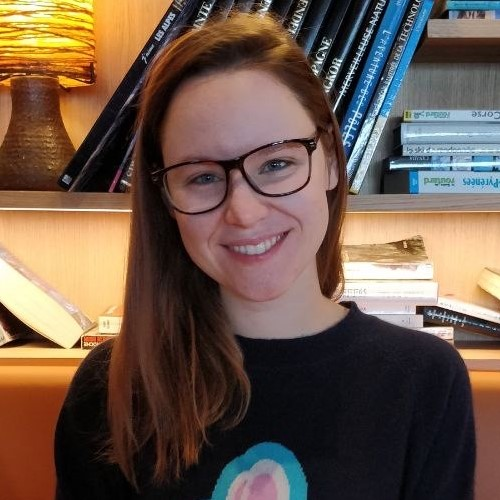
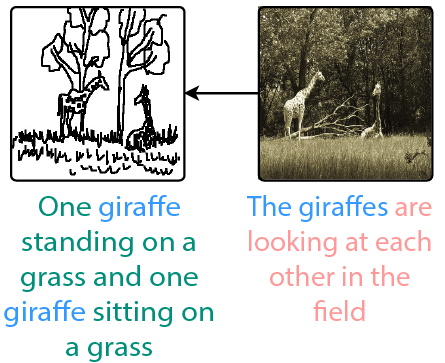
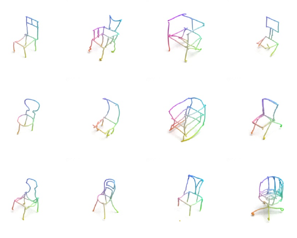
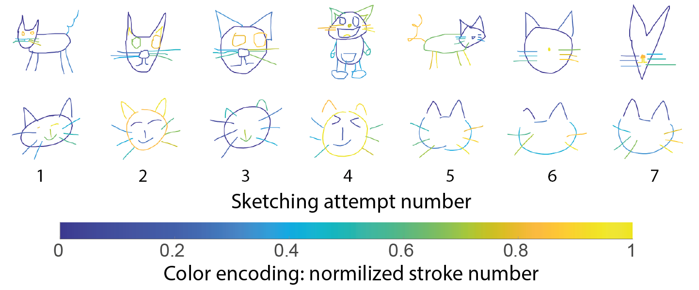
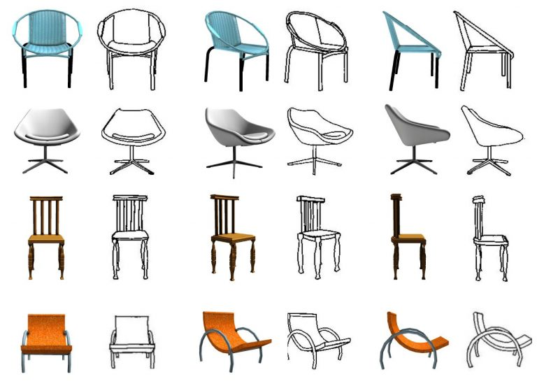
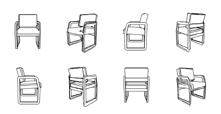
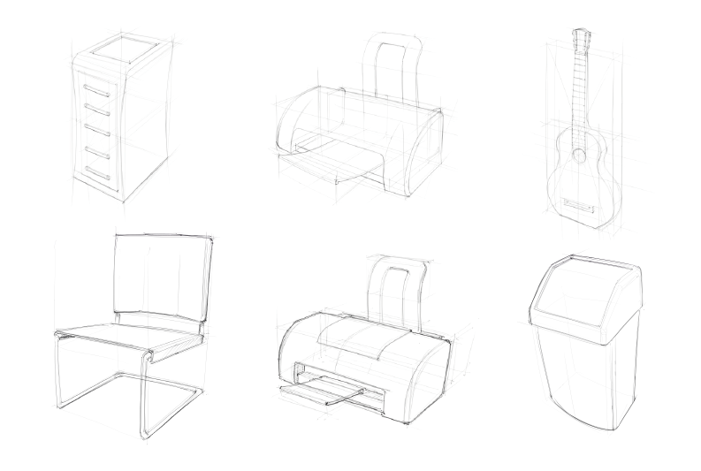
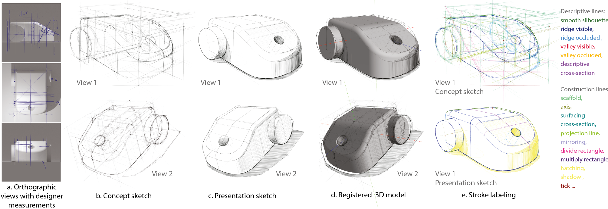
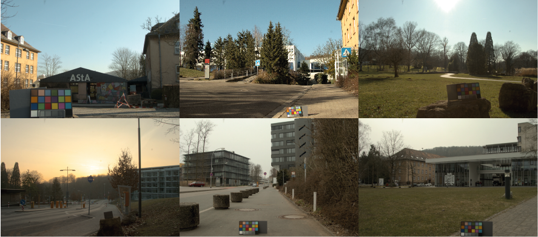

<section id="about" style="padding-top: 120px;">	

	<!-- Image -->
	

				
	

	
	
			
		

		<h4>Dr. Yulia Gryaditskaya</h4>

		<h5>Assistant Professor (Lecturer) in Artificial Intelligence </h5>
		 
		
		<h5 id="affiliations">
			<a href="https://www.surrey.ac.uk/centre-vision-speech-signal-processing">CVSSP</a> and 
			<a href ="https://www.surrey.ac.uk/artificial-intelligence">Surrey Institute for People-Centred AI</a>, UK
			 
		</h5>

		Email address:
		
		

		
		 
		
		

			

			 <a href="Gryaditskaya_cv.pdf">Curriculum Vitae (108 KB)</a>
			

				<!-- 
		 -->
					<!--  <a href="https://diglib.eg.org/bitstream/handle/10.2312/2631883/thesis_gryaditskaya_compressed.pdf?sequence=1&isAllowed=y">PhD dissertation (410 MB)</a> -->
				<!-- 
 -->
			
			 
			

				
			
					  <a href="https://scholar.google.co.uk/citations?user=cBB96b4AAAAJ">Google Scholar</a>
				

				
			
					 <a href="https://www.linkedin.com/in/yulia-gryaditskaya-64a8164b/">LinkedIn</a>
				

				
			
					 <a href="https://github.com/ygryadit/">GitHub</a>
				

				
			
					 <a href="https://orcid.org/0000-0002-1951-6475">ORCID</a>
				

				
			
					 <a href="https://mobile.twitter.com/ygryaditskaya">Twitter</a>
				

			

			
	
		

	

</section>

<section>			

			
	<!-- Bio -->
	

		
				<h4 style="font-family: 'atlandsketchesbb_reg'; font-size: 300%;"> About </h4>
				
	
					Yulia Gryaditskaya is an Assistant Professor in Artificial Intelligence at CVSSP and the Surrey Institute for People-Centred AI, 
					where she leads the Computational Creativity and Modeling Lab (CCMLab) and is a co-director of the <a href='http://sketchx.ai/'>SketchX</a> group. 
					Her main research interests lie in AI, sketching and CAD for creation and creativity. 
				

				
					
					Before joining CVSSP, she was a postdoctoral researcher (2017-2020) at Inria, 
					<a href="https://team.inria.fr/graphdeco/">GraphDeco</a>, under the guidance of <a href ='http://www-sop.inria.fr/members/Adrien.Bousseau/'>Dr. Adrien Bousseau</a>, 
					where she studied concept sketching techniques and worked on sketch-based modeling.
					She received her PhD (2012-2016) from <a href="https://www.mpi-inf.mpg.de/">MPI Informatik</a>, 
					Germany, advised by <a href='https://people.mpi-inf.mpg.de/~karol/'>Prof. Karol Myszkowski</a> 
					and <a href='https://scholar.google.de/citations?user=s2Ibok8AAAAJ&hl=en'>Prof. Hans-Peter Seidel</a>. 
					Her PhD focused on High Dynamic Range (HDR) image calibration, capturing HDR video on a mobile device, 
					tone mapping of HDR content, structured light fields, and editing materials in such light fields.
					While working on her PhD, she spent half a year in the Color and HDR group in 
					<a href="https://www.technicolor.com/contact/research-and-innovation"> Technicolor R&D</a>, Rennes, France, 
					under the guidance of <a href='http://www.erikreinhard.com/about.html'>Dr. Erik Reinhard</a>. 
					She received a degree (2007-2012) in <a href="http://www.msu.ru/en/info/struct/depts/vmc.html">Applied Mathematics and Computer Science</a>  with a specialization in Operation Research and System Analysis
					from <a href="http://www.msu.ru/en/info/">Lomonosov Moscow State University</a>, Russia.  
				

				
				

					Yulia’s work has been published in top graphics and vision journals and conferences: 
					including multiple publications in ACM Transactions on Graphics, Computer Graphics Forum (CGF), IEEE Transactions on Image Processing (TIP), ACM SIGGRAPH, ECCV, CVPR and IEEE 3DV. 
					She also co-authored an international patent, based on her CGF publication.
				

				

					She frequently serves as a reviewer, program committee member, area chair and organizer in a large range of journals and conferences. 
					In particular, she served as a program committee member (area chair) for SIGGRAPH Asia 2021,2022 and SIGGRAPH 2022,2023.
				

				

					She led the organization effort of the popular Sketching for Human Expressivity Workshop Series (ICCV’21 and ECCV’22). 
					She is frequently invited as a speaker, thus, she gave keynote talks at the ECCV 2022 workshop: 
					"Drawings and abstract Imagery: Representations and Analysis" (DIRA) 
					and CogSci 2022 workshop "From Images to Symbols: Drawing as a Window into the Mind".
				

				<!-- 
 -->
					<!-- My research interests cover sketch-based modeling, sketch beautification, geometric deep learning, sketch classification, sketch generation, high dynamic range image and video capture, tone-mapping and calibration,  -->
					<!-- depth estimation from the structured light-fields, materials representation and editing.	 -->
				
				<!-- 
 -->
				
				

					<a href="https://www.rsipvision.com/ICCV2021-Friday/20/"> Interview at ICCV Daily </a>
				

				
				
				
	

</section>

<section id="publications" >

    
	

		<!-- Load publication  -->
		
		
		
		
		
		
		
		
		
		<!-- Print publications list -->
		
		
			<h3> Publications </h3>
            
			
				
										
				
										
					
			
			
			
			
			
				
				
					<!-- Year -->
					<h6 class='publ_year'> {{publ.year}} </h6>
					
				
				
				
				

					
					<!-- 
 -->
						<!-- 
	 -->
							<!--  -->
						<!-- 
	 -->
					<!-- 
 -->
					

						
		
													
						

					

					
					

						
								
							

								<!-- Title -->
								

									<!-- <a href="{{publ.title_link}}"> -->
										
										
											
											[{{publ.type}}{{tj | minus: j | plus: 1}}]
										
											
											[{{publ.type}}{{tc | minus: c | plus: 1}}]
											
										
										<!-- {{publ.title}} -->
										
										{{publ.title}}
										
									<!-- </a>  -->
								
						
								
								<!-- Authors -->
								
					
									{{publ.authors}}
								

								
								<!-- Venue -->
								

									{{publ.venue}}, {{publ.year}}.
								

						
								<!-- Data -->
								

									
										
											
												<a href="{{publ.paper_link}}"> 
												
												paper 
												
												thesis
													
												</a> 				
										
											
												Coming soon!
										
										
									
									
										| <a href="{{publ.project_link}}"> project_page </a> 
									
								
									
										| <a href="{{publ.code}}"> code </a> 
									
									
									<!--  -->
										<!-- | <a href="{{publ.bibtex_link}}"> bibtex </a>  -->
									<!--  -->
									
									
										| <button onclick="showAbstract(this.value)" type="button" name="abstract_btn" value="bib{{publ.publ_id}}">bibtex</button> 										
									
									
									
										| <button onclick="showAbstract(this.value)" type="button" name="abstract_btn" value="ab{{publ.publ_id}}">abstract</button> 
										
									
									
								
	
							

						

						
					

				

				
				

					

					
								
						

							<b>Abstract</b>: {{publ.abstract}}
						
	
					

					
				
				

				
				

					

					
								
						

							<object type="text/plain" data="{{publ.bibtex_link}}" width="100%">
							</object>							
						
	
					

					
				
				

				
				
				
			
	
	

</section>	

<section  id="datasets">

	

	
		
			<h3> Released datasets </h3>
			
			<!-- ---- -->
			
 2022 

			
			

			
				

					
		
						
					

				

				
				

						
	
						

							

								<a href='http://cvssp.org/data/fscoco'>FS-COCO: Scene sketches</a>  
								<a href='http://cvssp.org/data/fscoco/fscoco.tar.gz'>fscoco.tar.gz (2.2 GB)</a>
							

							
							

								Our dataset	comprises 10, 000 freehand scene vector sketches with per point space-time information by 100 non-expert individuals, offering both object-and scene-level abstraction. Each sketch is augmented with its text description.
								
								This datset is a part of the paper:
													
								

								FS-COCO: Towards Understanding of Freehand Sketches of Common Objects in COntext  
								Pinaki Nath Chowdhury, Aneeshan Sain, Ayan Kumar Bhunia, Tao Xiang, Yulia Gryaditskaya, Yi-Zhe Song  
								ECCV, 2022.
								

							

						

					

				

			

			
			<!-- ---- -->
			
 2021 

			
			

			
				

					
		
						
					

				

				
				

						
	
						

							

								<a href='https://cvssp.org/data/VRChairSketch/'> 3D VR chair sketches by non professionals </a>
							

							
							

								We present the first fine-grained dataset of 1,497 3D VR sketch and 3D shape pairs for 1,005 chair shapes with large shapes diversity from the ShapeNetCore dataset from 50 participants.
								
								This datset is a part of the paper:
													
								

								Fine-Grained VR Sketching: Dataset and Insights  
								Ling Luo, Yulia Gryaditskaya, Yongxin Yang, Tao Xiang, Yi-Zhe Song  
								Proceedings of International Conference on 3D Vision (3DV), 2021.
								

							

						

					

				

			

			
			
			<!-- ---- -->
			
 2020 

			
			

			
				

					
		
						
					

				

				
				

						
	
						

							

								<a href='https://drive.google.com/file/d/1mWEY7vFkOw790DwUtqcTX8fHzNBP_b1J/view?usp=sharing'> SlowSketch </a>
							

							
							

								1700 sketches from 12 participants of 20 categories, where the participants were asked to target early sketch recognition.
								
								This datset is a part of the paper:
													
								

								Pixelor: A Competitive Sketching AI Agent. So you think you can sketch?  
								Ayan Kumar Bhunia, Ayan Das, Umar Riaz Muhammad, Yongxin Yang, Timothy Hospedales, Tao Xiang, Yulia Gryaditskaya, Yi-Zhe Song  
								ACM Transactions on Graphics (Proceedings of SIGGRAPH Asia), 2020.
								

							

						

					

				

			

			
			<!-- ---- -->
			<!-- 
 2020 
 -->
			

				
				
				

					
		
					
					

				

				
				

					
	
						

							

								<a href='http://personal.ee.surrey.ac.uk/Personal/Y.Song/ProSketch-3Dchair.zip'> ProSketch-3DChair </a>
							

							
							

								A dataset of 1500 chair sketches by professional artists: front, side and 3/4 viewpoints.
								
								This datset is a part of the paper:
													
								

								Towards Practical Sketch-based 3D ShapeGeneration: The Role of Professional Sketches  
								Yue Zhong, Yonggang Qi, Yulia Gryaditskaya, Honggang Zhang, Yi-Zhe Song  
								IEEE Transactions on Circuits and Systems for Video Technology, 2020.
								

								
							

						

					

				

			

			
			<!-- ---- -->
			<!-- 
 2020 
 -->
			

				

					
	
					
					

				

				
					

					

					

						

							<a href='https://cvssp.org/data/SyntheticChairSketch/'> Synthetic Chair Sketches </a>
						

						
						

							The datset contains NPR sketches for a chair category of the ShapeNetCore dataset in two styles. 
							This datset is a part of the paper:
							
							

							Deep Sketch-Based Modeling: Tips and Tricks  
							Yue Zhong, Yulia Gryaditskaya, Honggang Zhang, Yi-Zhe Song  
							Proceedings of International Conference on 3D Vision (3DV) - (Spotlight), 2020.
							

						

					

					

				

			

			
			
			
			
			<!-- ---- -->
			
			<!-- 
 2020 
 -->
			

				

					
	
					
					

				

				
				

					

					

						

						<a href='https://drive.google.com/file/d/1FkKZfWt7O4xMy4ir5kCYcmwZLPk1uBcZ/view?usp=sharing'>3D VR sketch-3D Shape pairs</a>
						

					
						

							139 chair and 28 bathtub 3D VR sketches by novices.
							This datset is a part of the paper:
													
								

								Towards 3D VR-Sketch to 3D Shape Retrieval  
								Ling Luo, Yulia Gryaditskaya, Yongxin Yang, Tao Xiang, Yi-Zhe Song  
								Proceedings of International Conference on 3D Vision (3DV) - (Oral), 2020.
								

						

					

					

				

			

			
			<!-- ---- -->
			
			<!-- 
 2020 
 -->
			

				

					
	
					
					

				

				
				

					

					

						

							<a href='https://repo-sam.inria.fr/d3/Lift3D/OpenSketch++.zip'>OpenSketch++</a>
						

						
						

							16 Vector concept sketches by 2 designers, collected in addtion to the skecthes in the OpenSketch dataset.
							This datset is a part of the paper:
													
								

								
								Lifting Freehand Concept Sketches into 3D  
								Yulia Gryaditskaya, Felix Hähnlein, Chenxi Liu, Alla Sheffer, Adrien Bousseau  
								ACM Transactions on Graphics (Proceedings of SIGGRAPH Asia), 2020.
								

						

					

					

				

			

			
			<!-- ---- -->
			
			
 2019 

			
			

				

					
	
					
					

				

				
				

					

						

							

								<a href='https://repo-sam.inria.fr/d3/OpenSketch/'>OpenSketch</a>
							

							
							

								A richly-annotated dataset of more than 400 product design sketches.
								This datset is a part of the paper:
													
								

								
								OpenSketch: A Richly-Annotated Dataset of Product Design Sketches  
								Yulia Gryaditskaya, Mark Sypesteyn, Jan Willem Hoftijzer, Sylvia Pont, Frédo Durand, Adrien Bousseau  
								ACM Transactions on Graphics (Proceedings of SIGGRAPH Asia), 2019.
								

							

						

					

				

			

				
			
 2014 

			
			

				

					
	
					
					

				

				
				

					

						

							

								<a href='https://drive.google.com/file/d/12qovT3CuJIVHVdM2wtA4RXi62-4sVoDO/view?usp=sharing'>Calibrated HDR Images</a>
							

							
							

								A set of calibrated HDR images, with visible sky regions and color checker.
								
								This datset is a part of the paper:
													
								

									Sky Based Light Metering for High Dynamic Range Images  
									Yulia Gryaditskaya, Foteini Tania Pouli, Erik Reinhard, Hans-Peter Seidel  
									Computer Graphics Forum (Proc. Pacific Graphics), 2014.
								

							

						

					

				

			

			
			
	
	

	
</section>       	
		

<section id="students">
	
		
	

		<h3> Students </h3>
		
		

			<h4> PhD Students:</h4>
			<ul>
				<li> 2022, October - 2026, September <a href="https://www.surrey.ac.uk/people/ahmed-bourouis">Ahmed Bourouis</a>
					</li>
				<li> 2022, July - 2022, December <a href="https://www.unibo.it/sitoweb/gianluca.berardi3/en">Gianluca Berardi</a> visiting PhD student from the University of Bologna
					</li>
				<li> 
					2020 -- ongoing, <a href="https://rowl1ng.com/">Ling Luo</a> (coadvised with Yi-Zhe Song)
				</li>
				<li> 
					2021 -- 2022, <a href="https://scholar.google.co.in/citations?hl=en&user=HE2nfp0AAAAJ&view_op=list_works&sortby=pubdate&inst=15262737669262836719">Pinaki Nath Chowdhury</a> (coadvised with Yi-Zhe Song)
				</li>					
				<li> 2019 -- 2022 <a href ="https://www-sop.inria.fr/members/Felix.Hahnlein/">Felix Hahnlein</a> (primary advisor Adrien Bousseau), <i> has defended his PhD thesis on 2nd December 2022</i> , Now: Postdoctoral Researcher at the University of Washington</li>
				<li> 2020 -- 2022, <a href="https://www.researchgate.net/scientific-contributions/Yue-Zhong-2149391947">Yue Zhong</a> (coadvised with Yi-Zhe Song),
					<i>PhD thesis under review</i> </li>			
				<li> 2020 -- 2021, <a href="https://dblp.org/pid/226/4981.html">Anran Qi</a> (coadvised with Yi-Zhe Song)
					PhD student, <i>has defended her PhD thesis on 8th November 2021</i> , Now: Postdoctoral Researcher at The University of Tokyo</li>
				
			</ul>
			
			<h4> Master students (past): </h4>
			<ul>
				<li> 2022, Praveen Kumaran Velliangiri,
					Master thesis topic: "GANs for sketch to image translation task"
				</li>
				<li> 2022, Gavin Croft,
					Master thesis topic: "Conditional Generative Flow"
				</li>
				<li> 2019, Felix Hahnlein (coadvised with Adrien Bousseau)
						Research Internship: 'Sketch segmentation with geometric deep learning'</li>
				<li> 2018, Adele Saint-Denis (coadvised with Adrien Bousseau)
						Research Internship: 'Non-photorealistic rendering'</li>
				<li> 2017, Marina Menghetti  (main advisor Adrien Bousseau)
						Research Internship: 'Strokes extraction from input video'</li>
			</ul>
			
			<h4> Under graduate students: </h4>
			<ul>
				<li> 2015, Juliette Pelletier
					Engineering Internship: 'HDR Video Capture on a Mobile Device'
				</li>
			</ul>
		

	

</section>			

<section id="activities_prof">		
	

	
			
		<h3> Professional Activities </h3>
		

			2022-2023 <a href = "https://www.wigraph.org/events/2022-rising-stars-workshop/">Rising Stars in Computer Graphics Mentor</a>
		

		
		

			<h4> Area Chair/Technical Papers Committee Member:</h4> 
			<ul>
			<li><a href="https://s2023.siggraph.org/"> SIGGRAPH North America'23 </a></li>
			<li><a href="https://sa2022.siggraph.org/en/"> SIGGRAPH Asia'22 </a></li>
			<li><a href="https://s2022.siggraph.org/"> SIGGRAPH North America'22 </a>  </li>
			<li><a href="https://sa2021.siggraph.org/en/"> SIGGRAPH Asia'21 </a></li>
			</ul>
		
  
		
		

			<h4>Organizer:</h4> 
			<ul>
			<li> Solving CAD History and pArameters Recovery from Point clouds and 3D scans (SHARP), ICCV 2023 </li>
			<li><a href="https://she-workshop.github.io/"> 2nd Workshop on Sketching for Human Expressivity (SHE), ECCV 2022 </a></li>
			<li><a href="https://www.cvmp-conference.org/2022/committees/"> CVMP 2022: Short papers and demos chair </a></li>
			<li><a href="https://she-workshop.github.io/"> 1st Workshop on Sketching for Human Expressivity (SHE), ICCV 2021 </a></li>
			<li> Weekly SketchX group meetings, 2021 </li> 
			</ul>
		
 
		
		
		
		

			<h4>Reviewer:</h4> 
			<h6>Program/Paper Committee Member:</h6> 
			<ul>
			<li> Eurographics Symposium on Rendering (<a href="https://egsr.eu/2022/">EGSR 2022</a>), 
			</li>
			<li> IEEE/CVF Conference on Computer Vision and Pattern Recognition (<a href="https://cvpr2022.thecvf.com/">CVPR 2022</a>, <a href="https://cvpr2023.thecvf.com/">2023</a>), 
			</li>
			<li> International Conference on Computer Vision (<a href="https://iccv2021.thecvf.com/home">ICCV 2021</a>), 
			</li>
			<li> International Conference on 3D Vision (<a href="http://iccvm.org/2020/committee.htm">3DV 2021</a>),
			</li>
			<li> International Conference on Computational Visual Media (<a href="http://iccvm.org/2020/committee.htm">CVM 2020</a>)
			</li>
			</ul>
			
			

			<h6>Conferences:</h6> 				
			SIGGRAPH, SIGGRAPH Asia, Eurographics, Pacific Graphics, VMV
			

			

			<h6>Journals:</h6> 
			ACM TOG, CAVW, Computers & Graphics, JEI, JVIP, Multimedia Systems, TCSVT, TIP, TVCG
			

		

		
		

			<h4>Invited talks</h4>
			04/2023 Graphics and Imaging Lab - Universidad de Zaragoza -- <i>"Do you speak sketch?"</i>  
			12/2022 Inria Sophia Antipolis workshop -- <i>"Do you speak sketch?"</i>  
			10/2022 ECCV 2022 workshop: <a href="https://sites.google.com/view/eccv-dira">"Drawings and abstract Imagery: Representations and Analysis" (DIRA)</a> -- <i>"Do you speak sketch?"</i>  
			07/2022 CogSci 2022 workshop <a href="https://images2symbols.github.io/schedule/">"From Images to Symbols: Drawing as a Window into the Mind"</a>  		
			01/06/2022 <a href="https://complightlab.com/seminars/">Virtual Environments and Computer Graphics'</a> (VECG's) seminar series at UCL 						
			06/2021 Autodesk, UK  
			02/2021 University of Bath, UK  
			12/2020 <a href="https://www.youtube.com/watch?v=TixJu8p9QZQ"> Christmas Colloquium on Computer Vision, Skolkovo, Moscow, Russia</a> 
		
 
			
	
		
			
</section>			

<section id="activities_ac">				
	
		

	<h3> Academic activities </h3>
	
		<h4>Teaching:</h4>
		<ul>
			<li>2023 Semester 1, VR/AR and Metaverse, Department of Electrical and Electronic Engineering, University of Surrey</li>
			<li>2022 Semester 2, EEE2041 Computer Vision and Graphics, Department of Electrical and Electronic Engineering, University of Surrey</li>
			<li>2015,2016, <a href="https://graphics.cg.uni-saarland.de/courses/ris-2018/"> Realistic Image Synthesis </a> : HDR & Tone Mapping  at <a href="https://www.uni-saarland.de"> Saarland University </a></li>
		</ul>	
		
		<h4>Masters examiner</h4>
		<ul>
			<li>
				2022, Alejandro Hernandez Dıaz, Master thesis topic: "Understanding Vision-Language Models"
			</li>
			<li> 
				2022, Gavin Croft, Master thesis topic: "Conditional Generative Flow"
			</li>
		</ul>	
		
		<h4>PhD examiner/jury member</h4>
		<ul>
			<li>				
			2022, Felix Hähnlein, Inria, Universite C´ ote d’Azur, France. PhD thesis: "Binary Optimization for the Analysis and Synthesis
of Concept Sketches"
			</li>
			<li>				
			2022, Tarek Ben Charrada, École Nationale Supérieure de l’Électronique et de ses Applications CY University, France. PhD thesis: "3D Reconstruction from Single RGB Images"
			</li>
		</ul>

		
</section>		

<section id ="hobbies">

	

	

		<h4 style="font-family: 'atlandsketchesbb_reg'; font-size: 250%;">Hobbies</h4> 
		<ul>
			Sketching and painting (<a href="http://illustrators.ru/users/wonderland/portfolio">personal page</a>), architecture, city planning, traveling, hiking, sports.
		</ul>
	
	

</section>
